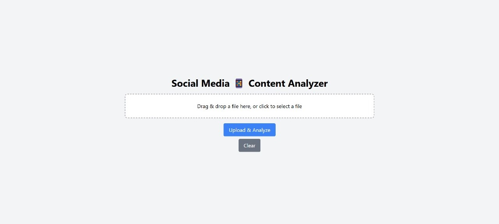

# Social Media Content Analyzer

## Project Overview
The **Social Media Content Analyzer** is a web application that enables users to upload PDFs and image files (JPG, PNG, JPEG) for text extraction. The application uses Optical Character Recognition (OCR) technology for images and PDF parsing for documents.

## Features
1. **File Upload:**
   - Drag-and-drop or click to upload PDF or image files (JPG, PNG, JPEG).
   
2. **Text Extraction:**
   - **PDFs:** Extracts text content while preserving basic formatting.
   - **Images:** Uses Tesseract.js to convert text from images through OCR.
   
3. **User Interface:**
   - Simple and intuitive interface to upload files.
   - Displays the extracted text from the uploaded file.
   - Option to clear the selected file and reset the extracted text.

## Tech Stack
- **Frontend:**
   - **React** with **Vite** for fast build and development.
   - **React-Dropzone** for file upload.
   - **Axios** for making HTTP requests to the backend server.

- **Backend:**
   - **Node.js** with **Express.js** for handling requests.
   - **Multer** for managing file uploads.
   - **PDF-Parse** for parsing text from PDFs.
   - **Tesseract.js** for OCR to extract text from images.

## Installation & Setup
### 1. Clone repository
- git clone https://github.com/GaurviNegi/Social-Media-Content-Analyzer.git
- cd projectDirectory

### 2. Backend:
- cd backend
- npm install
- node index.js

### 3. Frontend:
- cd frontend
- npm install
- npm run dev 

